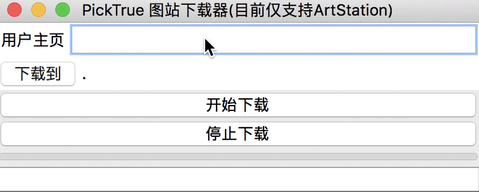
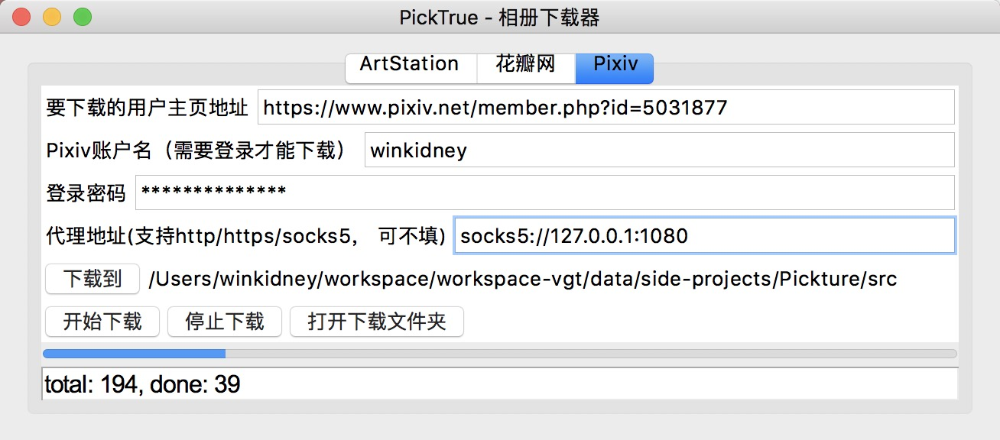
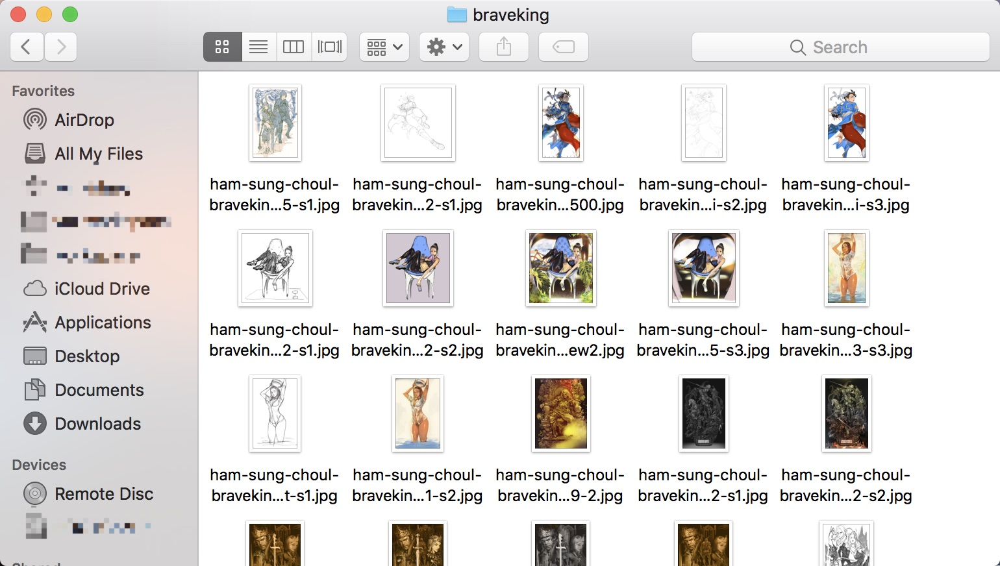
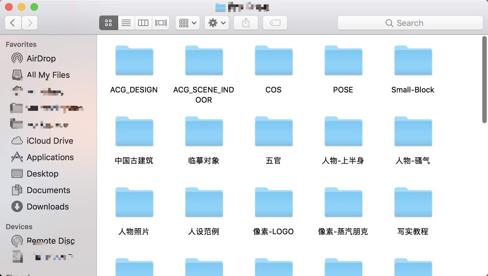

PickTrue
------------

初衷是帮你备份自己的花瓣采集，以免哪天被和谐。

强迫症可以收集喜爱画师的图。

画师/设计师们也可以用来构建自己的Visual Library

**划重点**：现在支持导出画板的画板和Tag信息，并且导入另一个个人画板项目[Pinry](https://github.com/pinry/pinry)啦！

# 下载

+ [windows-x64](https://github.com/winkidney/PickTrue/releases)
+ [macOS](https://github.com/winkidney/PickTrue/releases)

Linux请直接下载并安装Python项目即可，有打包需求再提

+ [适用于Artstation的油猴脚本](https://greasyfork.org/zh-CN/scripts/390597-picktruebrowser)
+ 推荐使用的油猴脚本插件（其他的不推荐，理由很多，不详细叙述啦），不推荐的插件可能也能运行，但我没有测试
  + [火狐的ViolentMonkey](https://addons.mozilla.org/en-US/firefox/addon/violentmonkey/?src=search)
  + [Chrome的ViolentMonkey](https://chrome.google.com/webstore/detail/violentmonkey/jinjaccalgkegednnccohejagnlnfdag)

# 用法

## 支持列表和网址范例

+ ArtStation
  + 个人页（按艺术家）： https://www.artstation.com/braveking
+ 花瓣网
  + 个人页 (按收藏者)： http://huaban.com/wmtzyzw1fl/
  + 按画板 ：http://huaban.com/boards/18720569/ 
+ Pixiv
  + 个人页（按作者，如果是漫画则会自动建立子文件夹）： https://www.pixiv.net/en/users/212801
+ 豆瓣
  + 相册：https://www.douban.com/photos/album/145972492/

## 通用

## Pixiv用法

如果本身已经全局翻墙或者路由翻墙，可以不填写单独的代理地址

## 需要配合油猴脚本的Artstation下载

1. 安装油猴脚本: [适用于Artstation的油猴脚本](https://greasyfork.org/zh-CN/scripts/390597-picktruebrowser)
2. 下载最新的[客户端](https://github.com/winkidney/PickTrue/releases)
3. 打开浏览器，访问Artstation你想要下载的指定用户的主页，例如 [https://www.artstation.com/braveking](https://www.artstation.com/braveking)
4. 启动PickTrue客户端，切换到Artstation的Tab，粘贴第三步的主页地址到地址填写处，设置好代理（没有代理似乎无法下载了）和下载文件夹，
   点击"开始下载"（注意）这时候下载进度不会更新，将不会有下载进度产生。
5. (火狐浏览器+ViolentMokney)在浏览器页面中，右键，选择"发送相册到PickTrue并下载"，注意这一步不要重复操作，操作一次就行了。
5. (Chrome内核浏览器+ViolentMokney)在浏览器页面中，按住Crtl+鼠标右键，就会开始下载（注意这一步不要重复操作，操作一次就行了）。
6. （可选步骤）打开浏览器控制台，观察控制台的日志。
7. 此时，下载器的下载进度（底部状态栏）应该开始更新了，耐心等待即可：）

# 已知问题

+ 花瓣下载会丢失部分不一致的数据（比较罕见），原因是花瓣的网页能看到的图，在花瓣的API里面不存在，属于花瓣网的Bug，以后有精力会修复这个问题，基本不影响使用
+ Pixiv下载需要代理，或者本地hosts，或者是全局翻墙

# 其他图站

欢迎提出建议：）

+ Pinterest (暂无计划)
+ NHentai (暂无计划)

# 其他功能

+ 自动记录上次选择的保存路径

# 更新日志

参见 `release` 页，https://github.com/winkidney/PickTrue/releases

# Bug反馈和使用交流

+ QQ群：863404640

# 附图

## ArtStation

## 花瓣

