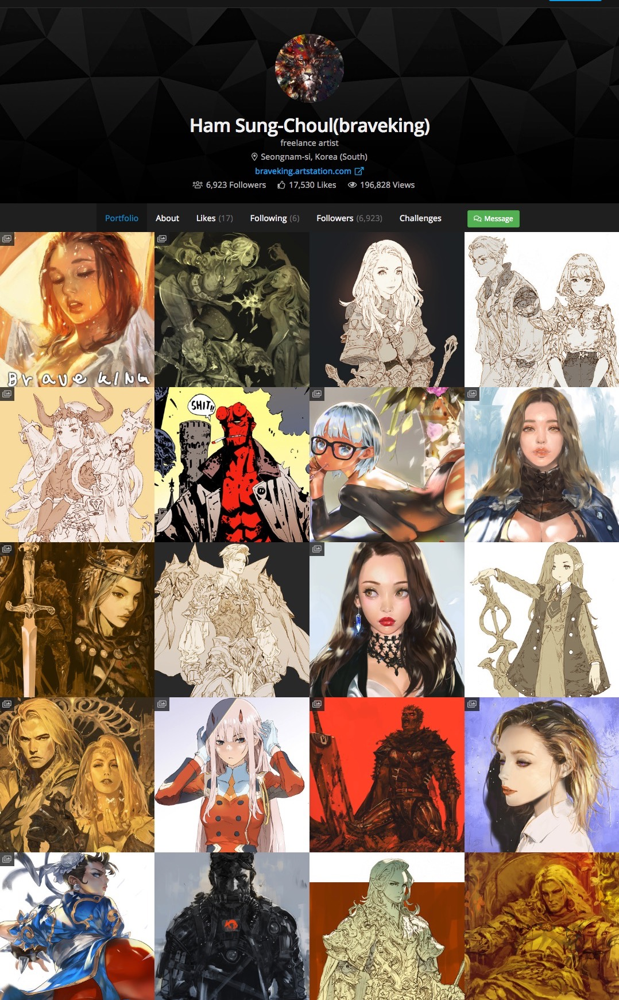

PickTure
------------

强迫症怎么能看到喜欢的画师不收图呢？

哪个画师不需要自己的Visual Library呢？

# 下载

+ [windows-x64](https://github.com/winkidney/PickTrue/releases)
+ [macOS](https://github.com/winkidney/PickTrue/releases)

Mac或者Linux请直接下载并安装Python项目即可，有打包需求再提.

# 用法

# 支持列表

+ Artstation
  + 个人页（按艺术家）

# 其他图站（尚未添加）

欢迎提出建议：）

+ 花瓣（计划中）
+ Pixiv （暂无计划）

# 附图

## Artstation个人主页参考

